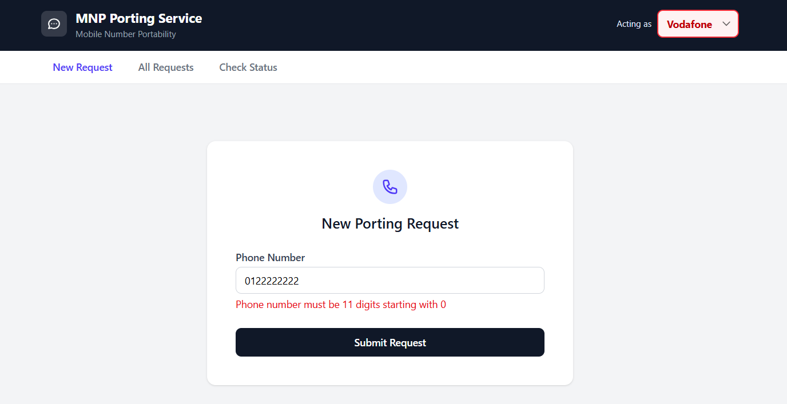
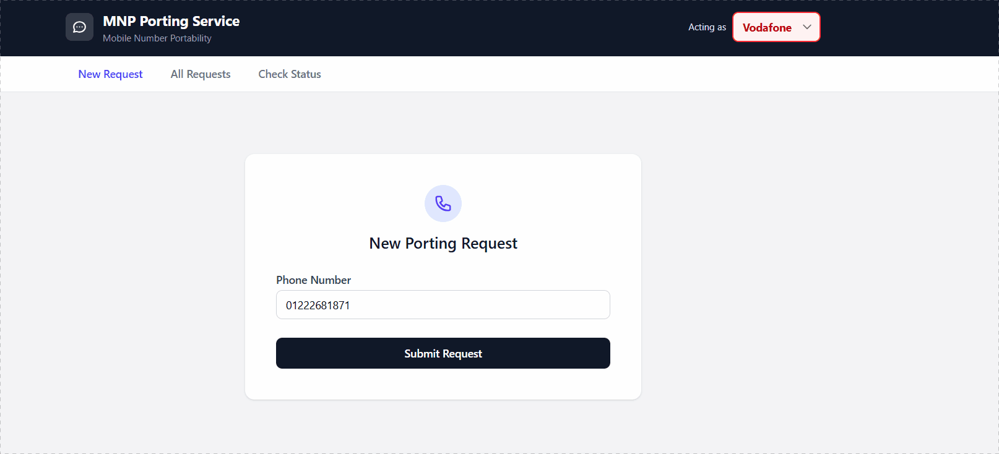
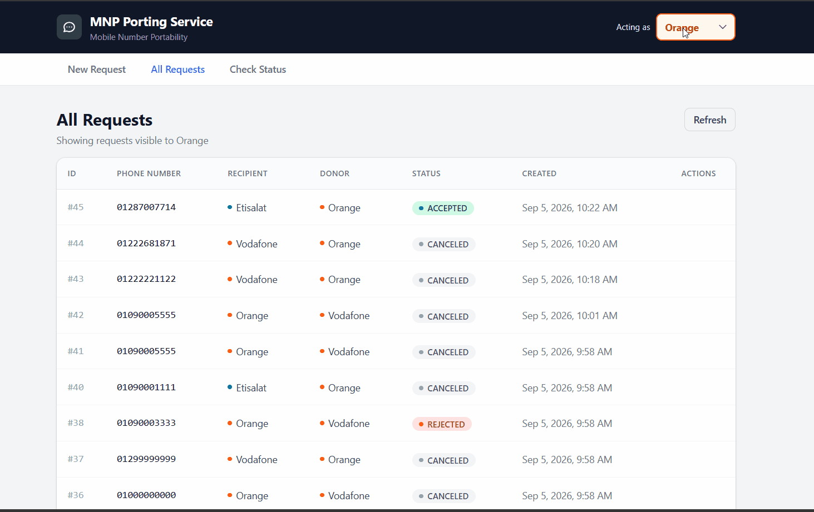
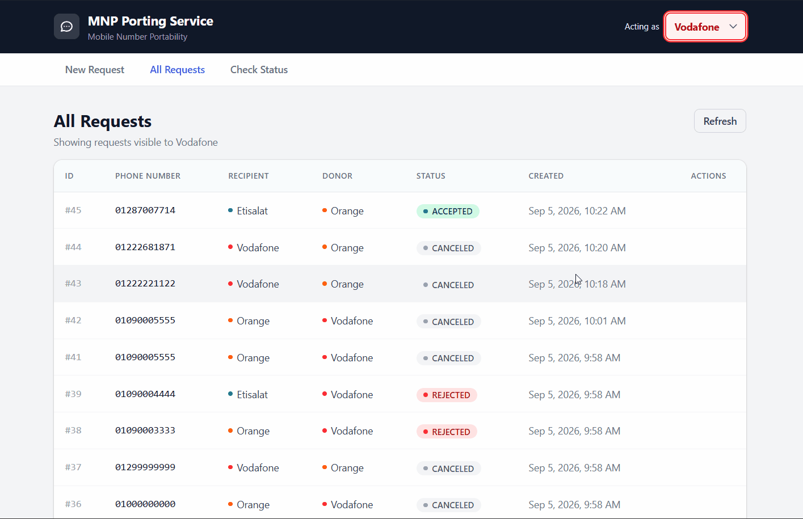
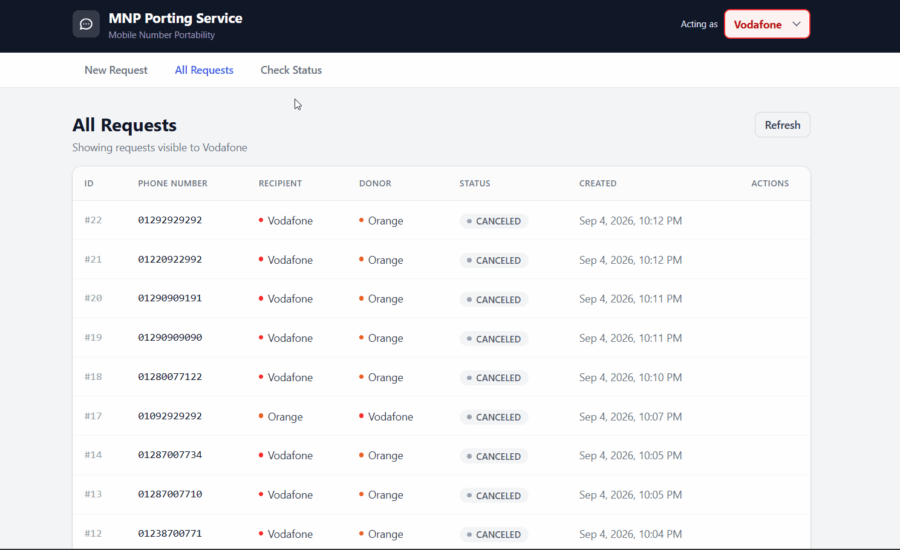
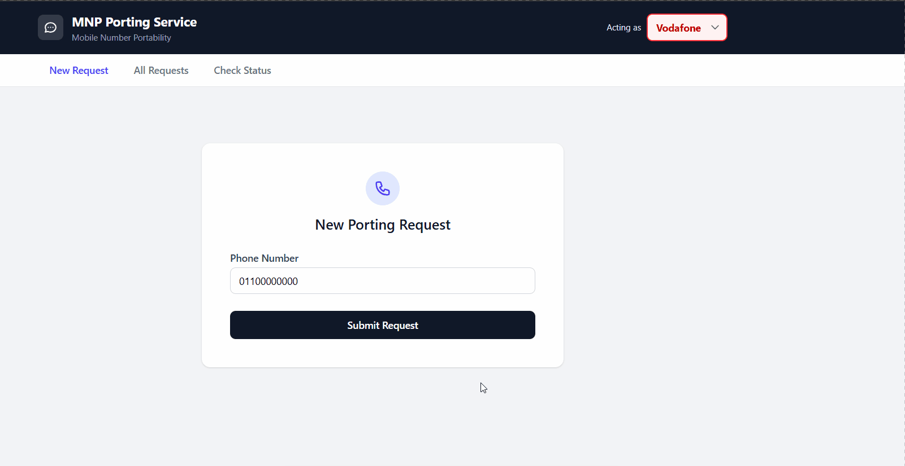
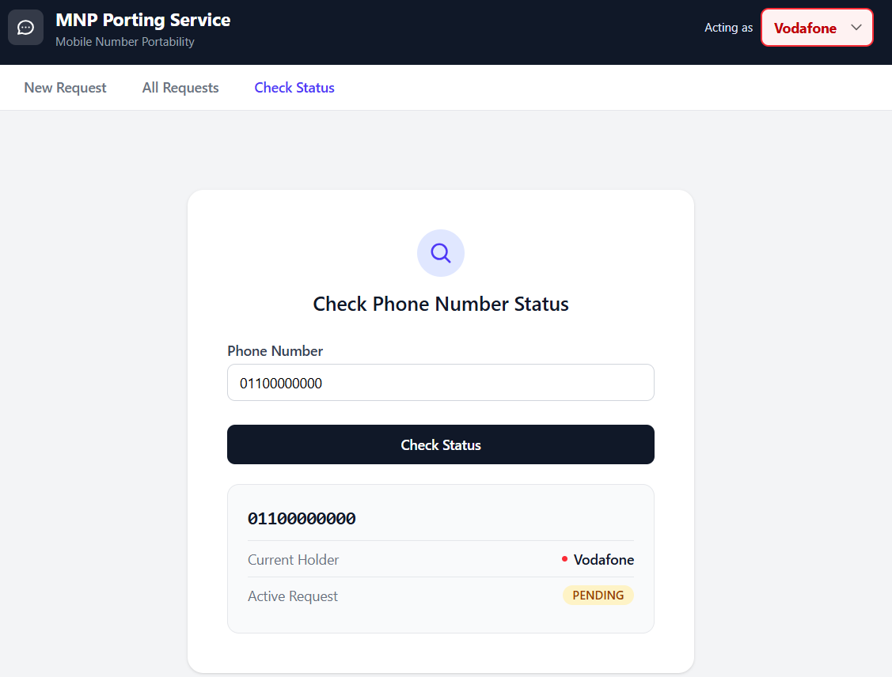

# MNP Porting Service

An operator-to-operator **Mobile Number Portability (MNP)** service — allows mobile network operators (Vodafone, Orange, Etisalat) to submit, accept, reject, and track number-porting requests between each other, with automatic timeout handling and a simple Angular management UI.

Built as a technical practicum for 4GTSS.

---

## Table of Contents

- [Overview](#overview)
- [Tech Stack](#tech-stack)
- [Screenshots](#screenshots)
- [Running the Project](#running-the-project)
  - [Option A: Docker Compose (recommended)](#option-a-docker-compose-recommended)
  - [Option B: Running locally](#option-b-running-locally)
- [API Overview](#api-overview)
- [Design Decisions & Assumptions](#design-decisions--assumptions)
- [Git Workflow](#git-workflow)
- [Testing](#testing)

---

## Overview

Mobile Number Portability lets a subscriber keep their phone number while switching from one mobile operator (the **Donor**) to another (the **Recipient**). This service models the **operator-to-operator negotiation** behind that process — not the subscriber-facing side (no customer identity, SIM issuance, or billing is modeled; see [Design Decisions](#design-decisions--assumptions)).

There are exactly three operators in this system — **Vodafone**, **Orange**, and **Etisalat** — each with a fixed range of phone numbers they originally issued. A Recipient submits a porting request for a phone number; the system automatically determines the Donor from the number's current holder (not just its original range — see below); the Donor then accepts or rejects the request. If the Donor doesn't respond within a configurable timeout, the request is automatically canceled by a background job.

Authentication/authorization is intentionally mocked per the task's requirements — every request identifies its calling operator via a plain `organization` header, rather than real credentials.

---

## Tech Stack

**Backend**
- Java 17
- Spring Boot 4.1.1 *(see note in [Design Decisions](#design-decisions--assumptions) on why this isn't 3.3.x)*
- Spring Data JPA / Hibernate
- MySQL 8.0
- Lombok

**Frontend**
- Angular 20.3.9
- TypeScript
- Tailwind CSS
- RxJS

**Infrastructure**
- Docker & Docker Compose

---

## Screenshots

### 1. Client-side validation
Inline validation on the create-request form, mirroring the backend's phone number format rule before a request is ever submitted.



### 2. Creating a porting request
Acting as Vodafone, submitting a porting request for an Orange-range number — the request succeeds and a success toast confirms it.



### 3. Role-based visibility across operators
Switching the "Acting as" operator between Vodafone, Orange, and Etisalat — each operator sees a different set of requests and statuses, matching the visibility rule (donor/recipient see everything; uninvolved third parties see accepted requests only).



### 4. Request list — pagination and operator switching
Browsing the paginated request list while switching between operators.



### 5. Request detail view
Opening a request's full detail view from the list.



### 6. End-to-end lifecycle: create → accept → verify
A complete ~30-second flow: registering a new porting request, switching to the donor operator's account to accept it, then searching the phone number on the status page as the new operator to confirm the current holder updated correctly.



### 7. Checking a pending number's status
Looking up a phone number with an active pending request via the phone-status page.



---

## Running the Project

### Option A: Docker Compose (recommended)

This brings up the Spring Boot application and MySQL together, with the database schema created automatically.

```bash
docker-compose up --build
```

Once both containers report healthy:
- Backend API: `http://localhost:8080/api/v1`
- Swagger UI: `http://localhost:8080/swagger-ui.html`

To run the frontend against this backend:

```bash
cd frontend
npm install
ng serve
```

Then open `http://localhost:4200`.

> **Note:** The frontend is not currently part of `docker-compose.yml` (the task's Dockerization requirement scopes this to the Spring Boot app + MySQL). It's run separately via the Angular CLI as shown above.

### Option B: Running locally (without Docker)

**Prerequisites:** Java 17, Maven, MySQL 8.0 running locally, Node.js 22+, Angular CLI 20+.

1. Create the database and schema:
```bash
   mysql -u root -p < db/init.sql
```
2. Configure `src/main/resources/application.yml` if your local MySQL credentials differ from the defaults (`mnp_user` / `mnp_password` / `mnp_db`).
3. Run the backend:
```bash
   mvn spring-boot:run
```
4. Run the frontend:
```bash
   cd frontend
   npm install
   ng serve
```

---

## API Overview

All endpoints are prefixed with `/api/v1`. Every request must include an `organization` header identifying the calling operator: `vodafone`, `orange`, or `etisalat`.

| Method | Endpoint | Description |
|---|---|---|
| `POST` | `/porting-requests` | Submit a new porting request (caller is the Recipient) |
| `POST` | `/porting-requests/{id}/accept` | Donor accepts a pending request |
| `POST` | `/porting-requests/{id}/reject` | Donor rejects a pending request |
| `GET` | `/porting-requests` | List requests visible to the caller (paginated) |
| `GET` | `/porting-requests/{id}` | Get a single request by id (subject to visibility rules) |
| `GET` | `/phone-numbers/{phoneNumber}/status` | Get a phone number's current holder and active request status |

Interactive documentation (via springdoc/Swagger) is available at `/swagger-ui.html` once the backend is running.

### Example request

```bash
curl -X POST http://localhost:8080/api/v1/porting-requests \
  -H "organization: orange" \
  -H "Content-Type: application/json" \
  -d '{"phoneNumber": "01012345678"}'
```

---

## Design Decisions & Assumptions

Deliberate choices made where the task was open to interpretation:

- **Donor is derived, never submitted.** The client sends only a phone number; the Donor is resolved server-side as the number's current holder — the recipient of its most recent Accepted request, falling back to the static range if never ported. A client-submitted Donor could be spoofed.
- **No `Phone`/`Operator` entities.** Operators and ranges are fixed, static data — a Java enum, not a table. "Current holder" is always derived from `PortingRequest` history via a query, not stored separately, avoiding two sources of truth that could drift apart.
- **No subscriber/customer entity.** The task scopes this to operator-to-operator negotiation only — no identity verification, tenure, or billing, none of which appear in the acceptance criteria.
- **Authorization is relationship-based, not role-based.** "Donor"/"recipient" are computed per-request by comparing the caller against that request's fields — not a stored role.
- **Visibility rule as one flat query condition**: `WHERE recipient = :caller OR donor = :caller OR status = 'ACCEPTED'` — equivalent to branched logic, simpler to express.
- **Spring Boot 4.1.1 instead of 3.3.x** — 3.3.x was no longer offered by Spring Initializr at build time; 4.1.1 is the current stable release and satisfies "3.3+" as stated.
- **Plain SQL script, not Flyway** — the task asks for "a MySQL script," and `ddl-auto: validate` means `db/init.sql` is the single source of truth, loaded automatically via MySQL's Docker init mechanism.
- **Pagination and get-by-id** — not explicitly required, added as reasonable, low-cost completions of the list endpoint.
- **Frontend scope** — the two required screens (create, view) are implemented; Accept/Reject actions and a phone-status page are included as bonus functionality reusing already-built backend endpoints.

---

## Git Workflow

Development took place on `dev/initial`, merged into `master` on completion and tagged `v1.0.0-dev`, per the task's branching requirements. The `dev/initial` branch was deleted from the remote after merging.

---

## Testing

A **Postman collection** covering all endpoints and 60+ scenarios (business rules, validation failures, and HTTP-level exception paths) is included at [`postman/MNP-Porting-Service.postman_collection.json`](postman/MNP-Porting-Service.postman_collection.json). Import it into Postman and run it via the **Collection Runner** to verify the API end-to-end.

> **Note:** the "8. Scheduled Expiry Job" folder requires a manual ~2-minute wait between its two requests to actually observe the background timeout behavior — running the full collection via Runner without that wait will show request 8.2 as still `PENDING`, which is expected, not a failure.

Beyond the collection, all endpoints, business rules, and exception paths were validated through extensive scripted scenario testing (100+ scenarios across create, accept, reject, list, get-by-id, and phone-status endpoints), covering:
- Every business rule (self-porting rejection, duplicate-pending rejection, donor-only authorization, visibility rules, multi-hop current-holder resolution)
- Schema and business validation failures
- HTTP-level edge cases (wrong method, wrong content-type, malformed pagination, non-existent routes)
- The scheduled expiry job, verified live against a temporarily shortened timeout
- The full Dockerized stack (`docker-compose up`), including fresh database initialization and container-restart data persistence

No automated test suite is included in this submission; testing was performed via scripted HTTP requests against the running application.
